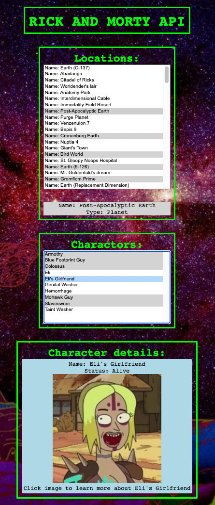
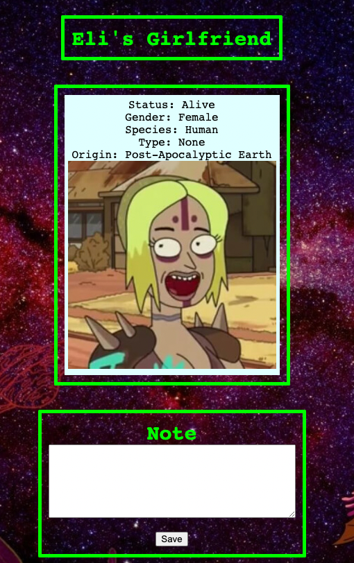

## Project Title: Rick and Morty API
This API displays all locations in the popular TV show Rick and Morty in an options list under “Locations”. The grayed-out options are locations with no residents. 
When the user selects a location from the options list, a gray box with the location name and type will appear. If there are residents of that location, the residents will appear in the options list under “Characters”. In this characters list, the grayed-out names are those characters who are dead.
Regardless of whether the character is alive or dead, when a character is selected from the options list, the character’s name, status, and image will appear in a box under “Character Details”.

If the user clicks the image, a new page will open with more details about the character: gender, species, type, and origin. Under the details will be a text box where the user can enter notes about this character. After clicking submit, the user will see a confirmation that their note is sent and the confirmation will diaappear after 2 seconds.
In this project, to query information, I used REST endpoints because it feels more natural to me. Also, it’s older so there are more resources on REST endpoints.
